# VISUAL INTERFACE REPORT
## Objective and Task Description  
The objective of this task is to extract perceptually important boundaries from grayscale images based on intensity variations. Here, “important boundaries” do not simply refer to locations with strong local intensity changes, but rather to structural edges that effectively describe object contours and global shape as perceived by human vision.

As a first step, the original image is carefully inspected and a hand-drawn sketch of the main contours is created. This sketch represents the boundaries that are considered important from a human perceptual perspective and serves as a ground-truth reference for later comparison and evaluation of algorithmic results.

Based on this reference, a signal-processing-based edge extraction method is designed and implemented. The grayscale image is treated as a two-dimensional signal and analyzed by applying one-dimensional wavelet transforms independently along the x and y directions. This multi-scale analysis enables the extraction of intensity change responses at different spatial scales, from which candidate edge points are obtained by integrating responses across scales.

Furthermore, to suppress fine texture details and noise that do not correspond to meaningful object boundaries, a cross-scale consistency constraint is introduced. Only edge points that exhibit significant responses across multiple scales are retained, with the aim of improving correspondence to the manually drawn contours.

Finally, the extracted edge maps are quantitatively evaluated by comparison with the hand-drawn reference using pixel-level evaluation metrics. Through this analysis, the effects of multi-scale processing and cross-scale consistency on boundary extraction performance are examined and discussed.

## Attachments and Source code
If you need to see my code and the raw output, you can check my GitHub repository or the project archive.

Github repository:
https://github.com/Natsume0129/visualInterface

## Overview
The experiments in this study are divided into two main parts, each accompanied by corresponding parameter tuning and optimization.

In the first part, an image of my own cat is selected as the test subject. Despite extensive parameter tuning and multiple attempts with different configurations, the final edge extraction results are not considered satisfactory. Due to the rich fur texture of the cat image, many detected edges correspond to fine texture details rather than the intended object contours, making it difficult to achieve good agreement with the manually drawn sketch.

Therefore, in the second part of the experiments, the well-known Lena image, which is widely used in the computer vision community, is chosen as the input image. Based on the experience gained from the first part, two different styles of hand-drawn sketches are created for the Lena image, reflecting different interpretations of perceptually important boundaries.

Furthermore, instead of manually adjusting parameters, a parameter enumeration strategy is adopted. Various combinations of parameters are systematically evaluated, and the best-performing configuration is selected based on quantitative metrics. As a result, an F1 score exceeding 0.7 is achieved, which is considered a reasonably good performance for this task.

## Algorithm Description

This section describes the wavelet-based edge detection pipeline implemented in this work. The algorithm consists of two independently evaluated edge extraction strategies: a baseline multi-scale fusion method and a cross-scale consistency-based method.

---

#### Block 1 — Inputs and Parameters

* Input grayscale image: $I \in [0,255]^{H \times W}$
* Hand-drawn sketch image (used to build ground truth): $S \in [0,255]^{H \times W}$

Key parameters:

* Wavelet type: `haar`
* Number of wavelet scales: `LEVELS = L`
* Morphological opening kernel size: `MORPH_OPEN_K`
* Consistency parameters: `(CONSISTENCY_K, CONSISTENCY_Q)`
* Evaluation tolerance (pixels): `TOLERANCE_PX`

```text
Input:
  I : grayscale image
  S : sketch image

Output:
  P_base : baseline edge map
  P_cons : consistency-based edge map
  Precision / Recall / F1 scores
```

---

#### Block 2 — Ground Truth Construction from Sketch

The hand-drawn sketch is converted into a binary ground-truth edge map ( G ).

Steps:

1. Resize sketch to match the input image resolution (nearest neighbor).
2. Apply Gaussian blur for threshold stability.
3. Perform Otsu binarization.
4. Automatically invert the binary image if the background is detected as white.
5. Apply optional morphological opening to remove small artifacts.

```python
def make_gt_from_sketch(sketch, target_shape):
    sketch = resize_nearest(sketch, target_shape)
    blur = gaussian_blur(sketch, k=5)
    bw = otsu_threshold(blur)

    if white_ratio(bw) > 0.5:
        bw = invert(bw)

    bw = morph_open(bw, k=MORPH_OPEN_K)
    return bw  # binary GT mask
```

---

#### Block 3 — Multi-scale Wavelet Responses in X and Y Directions

The grayscale image is treated as a collection of one-dimensional signals.

* Each **row** is processed to obtain horizontal responses.
* Each **column** is processed to obtain vertical responses.

For each 1D signal:

* Stationary Wavelet Transform (SWT) is applied.
* Absolute values of detail coefficients are used as edge responses.
* Padding is applied if necessary to satisfy SWT length requirements.

```python
def swt_detail_abs_1d(signal, wavelet, L):
    signal_pad = pad_to_multiple_of_2powL(signal, L)
    coeffs = pywt.swt(signal_pad, wavelet, level=L)

    details = []
    for (cA, cD) in coeffs:
        details.append(abs(cD))
    return details
```

The resulting responses are stored as:

* $E_x^{(l)} \in \mathbb{R}^{H \times W}$
* $E_y^{(l)} \in \mathbb{R}^{H \times W}$

for each scale $l = 1, \dots, L$.
---

#### Block 4 — Baseline Multi-scale Fusion

In the baseline method, responses from all scales are aggregated before thresholding.

1. For each scale, responses are weighted such that coarser scales receive larger weights:

   $$
   w_l \propto 2^l
   $$

2. Weighted responses are summed across scales separately for $x$ and $y$ directions.

3. The final edge energy map is computed using L2 fusion:

   $$
   E = \sqrt{E_x^2 + E_y^2}
   $$


```python
Ex = sum(w[l] * Ex_levels[l] for l in range(L))
Ey = sum(w[l] * Ey_levels[l] for l in range(L))
E  = sqrt(Ex*Ex + Ey*Ey)
```

The energy map is normalized to [0,255] and binarized using Otsu thresholding (or a manual threshold if specified), followed by optional morphological opening.

```python
P_base = binarize_edge_map(normalize(E))
```

---

#### Block 5 — Cross-scale Consistency-based Edge Extraction

The consistency-based method enforces stability across multiple wavelet scales.

For each scale ( l ):

1. Combine x- and y-direction responses using a maximum operation:

   $$
   S^{(l)} = \max\left(E_x^{(l)}, E_y^{(l)}\right)
   $$

2. Determine a scale-specific threshold using a quantile ($Q$).

3. Mark pixels whose response exceeds this threshold.


A pixel is retained in the final consistency mask if it is marked significant in at least `CONSISTENCY_K` scales.

```python
count = 0
for l in range(L):
    S = max(Ex_levels[l], Ey_levels[l])
    thr = quantile(S, CONSISTENCY_Q)
    count += (S >= thr)

P_cons = (count >= CONSISTENCY_K)
```

The resulting binary mask ( P_{\text{cons}} ) represents edges that are stable across scales.

---

#### Block 6 — Independent Evaluation of Baseline and Consistency Methods

The baseline edge map ($P_{\text{base}}$) and the consistency-based edge map ($P_{\text{cons}}$) are evaluated **independently**.

To allow small spatial misalignment between detected edges and the ground truth, the ground-truth mask is dilated by `TOLERANCE_PX` pixels before computing true positives.

```python
G_tol = dilate(G, radius=TOLERANCE_PX)

TP = sum(P & G_tol)
FP = sum(P & ~G_tol)
FN = sum(~P & G)
```

Precision, Recall, and F1-score are then computed for each method.

---

#### Block 7 — Visualization via Overlay Images

For qualitative analysis, overlay images are generated:

* Green: ground-truth edges
* Red: predicted edges
* Yellow: overlapping pixels (correct detections)

```python
overlay[GT] = green
overlay[PRED] = red
overlay[GT & PRED] = yellow
```

These visualizations help interpret the quantitative evaluation results.

---

#### Summary

This algorithm implements and compares two wavelet-based edge detection strategies:

* **Baseline method**: emphasizes edge strength via multi-scale energy fusion.
* **Consistency-based method**: emphasizes structural stability across scales.

Both methods are evaluated separately to analyze the trade-off between edge completeness and robustness to texture and noise.

## Specific experiments and results, and optimization.

### Part 1 CAT EXPERIMENT

#### Input
<figure style="text-align: center;">
  <div style="display: flex; justify-content: center; gap: 10px;">
    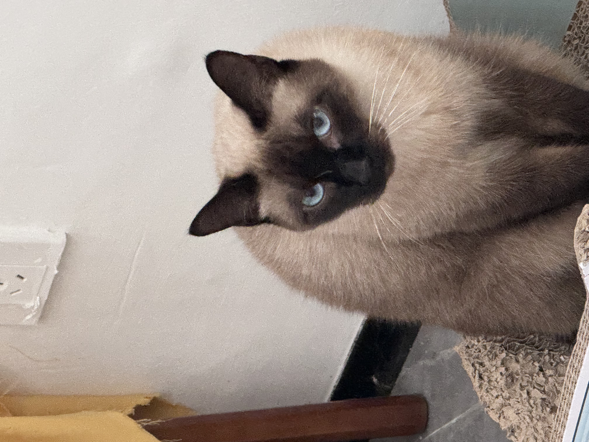
    
    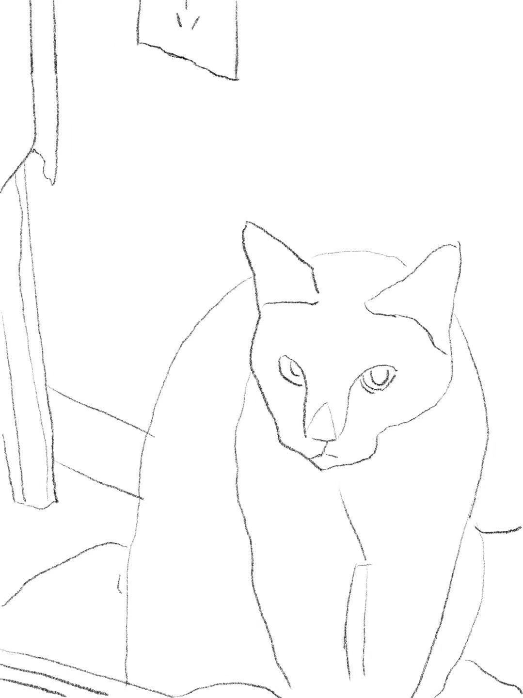
  </div>
  <figcaption>
    Comparison: Origin picture, Grayscale picture, Sketch
  </figcaption>
</figure>

#### Ground truth
(a) Input grayscale image
(b) Hand-drawn sketch converted to a binary ground-truth edge map
<figure style="text-align: center;">
  <div style="display: flex; justify-content: center; gap: 10px;">
    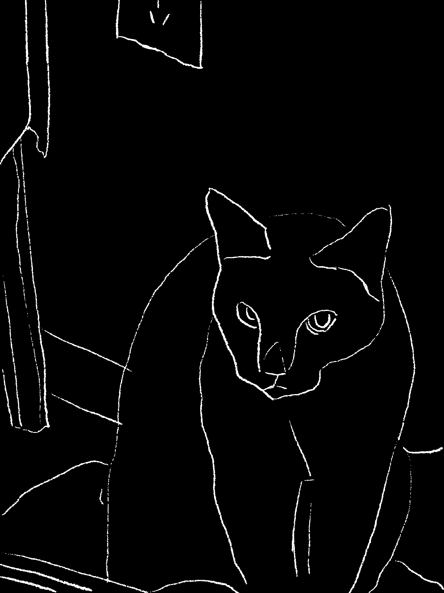
  </div>
  <figcaption>
    Image of Ground truth
  </figcaption>
</figure>

#### Multi-scale Wavelet Responses
The figure shows the wavelet detail responses along the x-direction at different scales. Each row of the image is treated as a one-dimensional signal and analyzed using the stationary wavelet transform. The absolute values of the detail coefficients are used to represent the magnitude of intensity changes at each scale.

At finer scales, the responses mainly highlight high-frequency components such as textures, noise, and fine details. These responses tend to be spatially dense and include many variations that do not correspond to perceptually important object boundaries. As the scale becomes coarser, the responses become more concentrated around major structural contours, while fine textures are progressively suppressed.

This multi-scale behavior illustrates that perceptually meaningful boundaries are more stable across coarser scales, whereas texture-induced edges tend to appear predominantly at finer scales. Such observations motivate the use of multi-scale fusion and cross-scale consistency constraints in the subsequent edge extraction process.


<figure style="text-align: center;">
  <div style="display: flex; justify-content: center; gap: 10px;">
    
    

  </div>
    <div style="display: flex; justify-content: center; gap: 10px;">
    
    

  </div>
  <figcaption>
    Multi-scale Wavelet Responses in the x-direction from low scale to high
  </figcaption>
</figure>

#### Fused Edge Energy Map
The fused edge energy map obtained by integrating the multi-scale wavelet responses from both x and y directions. After computing wavelet detail responses at multiple scales, the responses are first aggregated across scales using weighted summation, where coarser scales are assigned larger weights. This strategy emphasizes large-scale structural variations while reducing the influence of fine-scale texture responses.

The aggregated responses in the x and y directions are then combined using an L2-type fusion, resulting in a continuous-valued edge energy map. In this representation, higher intensity values indicate locations with stronger and more consistent intensity changes across scales and directions.

This edge energy map serves as an intermediate result between the multi-scale wavelet analysis and the final binary edge maps. It provides a global view of where the algorithm detects significant intensity transitions before thresholding, and it forms the basis for the subsequent baseline edge detection and consistency-based analysis.

<figure style="text-align: center;">
  <div style="display: flex; justify-content: center; gap: 10px;">
    
  </div>
  <figcaption>
    Fused Edge Energy Map
  </figcaption>
</figure>

#### Baseline and Consistency-based Results on the Cat Image
<figure style="text-align: center;">
  <div style="display: flex; justify-content: center; gap: 10px;">
    
    
  </div>
  <figcaption>
    Baseline and Consistency-based Results on the Cat Image
   </figcaption>
     <figcaption>
    Green indicates ground truth edges, red indicates detected edges, and yellow indicates correctly detected edges where the two overlap.
   </figcaption>
</figure>

The figure shows the edge detection results obtained by the baseline method and the consistency-based method on the initial test image, which is an image of a cat. Both methods are evaluated using pixel-level precision, recall, and F1-score with a tolerance of two pixels.

For the baseline method, a large number of edge pixels are detected after thresholding the fused multi-scale edge energy map. Although this results in relatively high recall, most of the detected edges correspond to fine fur textures and local intensity fluctuations rather than perceptually meaningful object boundaries. As a result, the detected edges exhibit poor alignment with the manually drawn sketch, leading to very low precision.

The consistency-based method introduces a cross-scale stability constraint by retaining only those edge responses that are significant across multiple wavelet scales. This strategy suppresses a portion of texture-induced responses and slightly improves precision compared to the baseline method. However, due to the strict nature of the consistency requirement, many true boundary pixels are also removed, which leads to a noticeable reduction in recall.

The quantitative evaluation results for this experiment are summarized as follows:

Baseline: Precision = 0.0858, Recall = 0.4877, F1 = 0.1460

Consistency-based: Precision = 0.0910, Recall = 0.3829, F1 = 0.1471

Overall, both methods achieve similarly low F1-scores on the cat image, indicating limited effectiveness under this experimental setting. These results suggest that images dominated by dense fine-scale textures, such as animal fur, pose a significant challenge for the proposed wavelet-based edge detection approach. In such cases, intensity-based edge responses are largely governed by texture patterns rather than clear structural boundaries, making it difficult to extract perceptually important contours using fixed parameters.

In addition, the test image features a Siamese cat, whose coat exhibits a distinctive high-contrast black–white gradient. This strong internal intensity variation further complicates boundary localization, as it produces prominent responses within the object region itself. Consequently, both the baseline and consistency-based methods struggle to distinguish true object contours from internal texture and shading variations.

These observations motivate the second part of the experiments, in which a different test image and refined experimental settings are adopted to more effectively evaluate the proposed methods.

### Part 2 Lena Image EXPERIMENT
#### Input
Due to the unsatisfactory performance of the proposed method on the cat image, a new test image was selected for further experiments. Specifically, the well-known Lena image, which is widely used as a benchmark in the computer vision community, was chosen as the input image.

The figure shows the input data used in this experiment, including the original RGB image, the corresponding grayscale image, and manually drawn sketch images. The grayscale image is used as the input for the wavelet-based edge detection pipeline, while the sketches serve as ground truth for quantitative evaluation.

In addition, multiple hand-drawn sketches with different styles were created for the same Lena image. These sketches differ in terms of the level of detail and the emphasis on perceptually important boundaries. By using sketches with different styles, this experiment aims to investigate how variations in ground truth representation influence the evaluation results and to assess the robustness of the proposed method under different annotation conditions.
<figure style="text-align: center;">
  <div style="display: flex; justify-content: center; gap: 10px;">
    
    

  </div>
    <div style="display: flex; justify-content: center; gap: 10px;">
    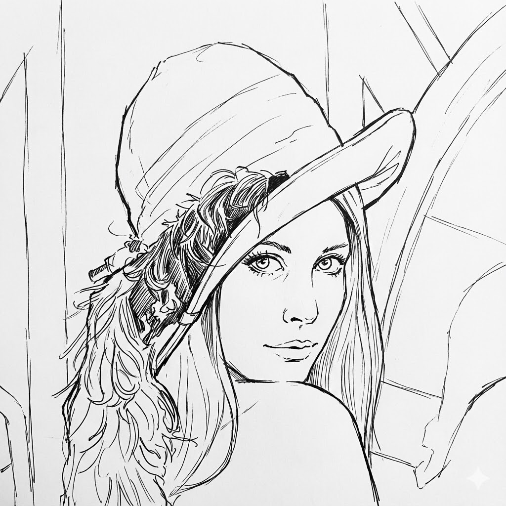
    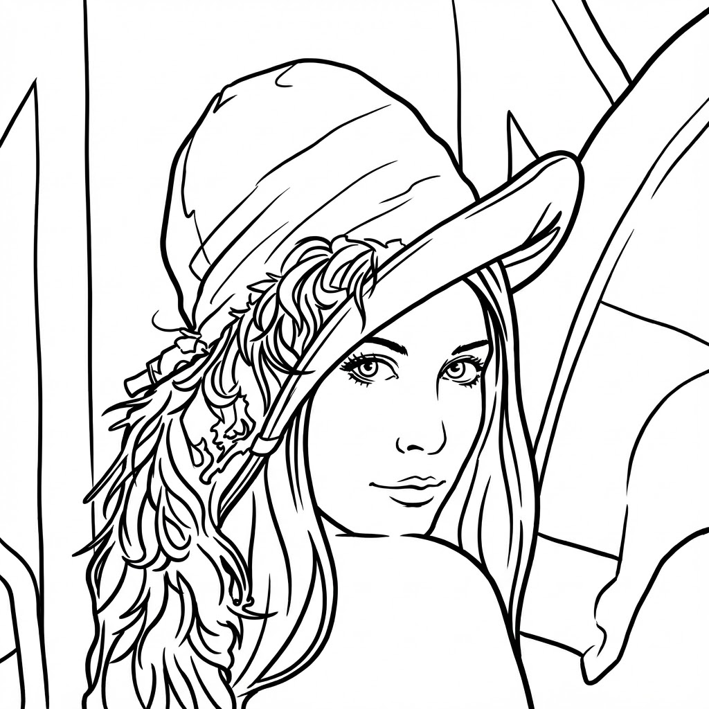

  </div>
  <figcaption>
    Lena Image Origin, Grayscale, Sketch1,Sketch2
  </figcaption>
</figure>

#### output

First, for sketch styles 1 and 2, the pipeline was executed using exactly the same parameter settings as those used in the cat experiment.

For sketch 1, the baseline method achieved an F1 score of 0.6702, with relatively high recall, indicating that most annotated boundaries were successfully detected. The consistency-based method improved precision but significantly reduced recall, leading to a lower F1 score of 0.5955.

For sketch 2, the baseline method again achieved a balanced performance with an F1 score of 0.6786. The consistency-based method further increased precision to 0.7900, but recall dropped sharply, resulting in an overall lower F1 score of 0.5637.

These results indicate that while cross-scale consistency effectively suppresses texture-induced edges, it tends to remove valid boundary pixels when the ground truth focuses on coarse contours, leading to a precision–recall trade-off.

This represents changes at different scales in the x-direction.
<figure style="text-align: center;">
  <div style="display: flex; justify-content: center; gap: 10px;">
    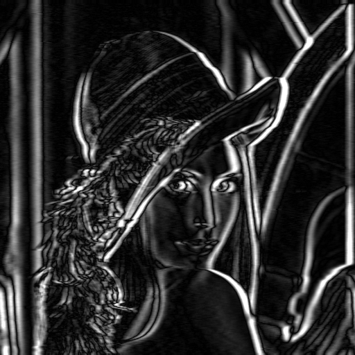
    
    
    
  </div>
  <figcaption>
    Different scale in X axes
  </figcaption>
</figure>

The two sketches correspond to different ground truths. As you can see, sketch one has thinner lines and focuses more on detail, while sketch two has relatively thicker lines and emphasizes the outline more.
<figure style="text-align: center;">
  <div style="display: flex; justify-content: center; gap: 10px;">
    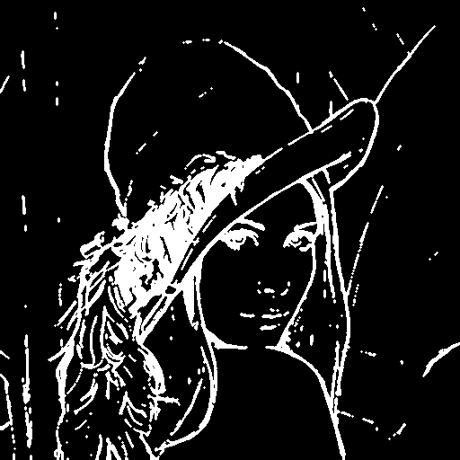
    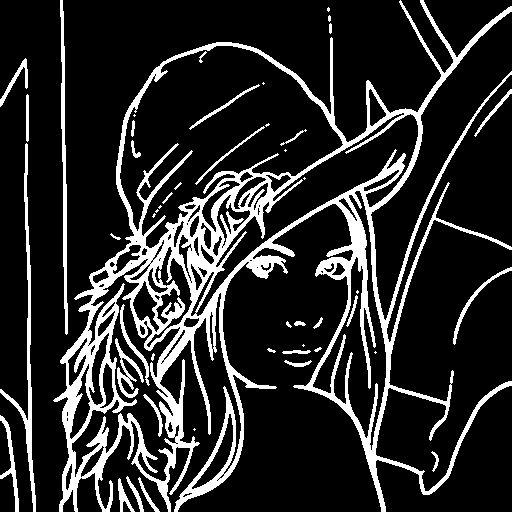
  </div>
  <figcaption>
    Ground truth of 2 sketches
  </figcaption>
</figure>

The following are the baseline and consistency of sketch 1:<figure style="text-align: center;">
  <div style="display: flex; justify-content: center; gap: 10px;">
    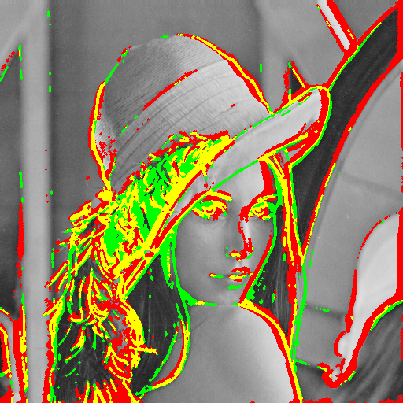
    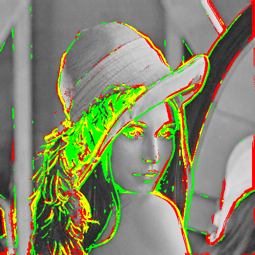
  </div>
  <figcaption>
    output of sketch 1
  </figcaption>
       <figcaption>
    Green indicates ground truth edges, red indicates detected edges, and yellow indicates correctly detected edges where the two overlap.
   </figcaption>
</figure>

From the images, the baseline method detects most major boundaries and achieves higher overall accuracy, while the consistency-based method produces cleaner edges but removes many valid boundary pixels, leading to lower recall.

The following are the baseline and consistency of sketch 2:

<figure style="text-align: center;">
  <div style="display: flex; justify-content: center; gap: 10px;">
    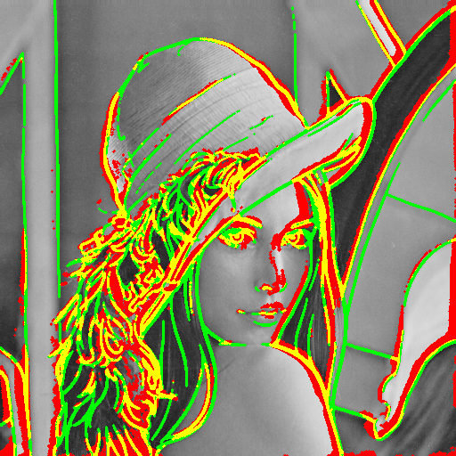
    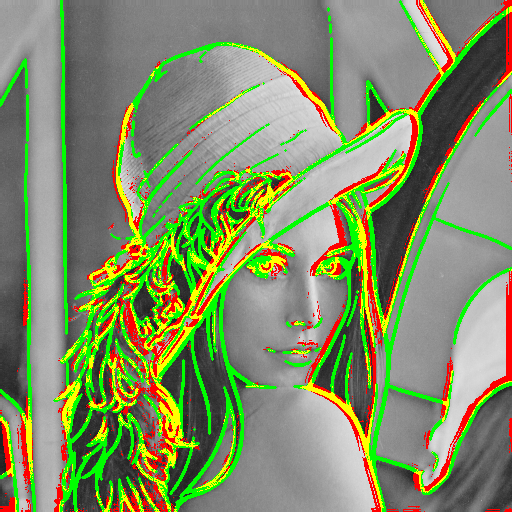
  </div>
  <figcaption>
    output of sketch 2
  </figcaption>
       <figcaption>
    Green indicates ground truth edges, red indicates detected edges, and yellow indicates correctly detected edges where the two overlap.
   </figcaption>
</figure>

Compared to sketch 1, sketch 2 emphasizes coarse object contours, under which the consistency-based method aligns better with the ground truth by suppressing fine texture edges and preserving dominant structures.

#### Optimization
The initial experiments showed that using a fixed set of parameters led to unstable performance across different images and sketch styles. In particular, edge responses were often dominated by fine texture details, which reduced alignment with the manually drawn ground truth. This observation motivated a systematic parameter optimization process.

The optimization was performed using a grid search strategy. Instead of manually tuning parameters, multiple combinations were exhaustively evaluated under the same experimental protocol. The search space included both wavelet-related parameters and cross-scale consistency parameters. Specifically, different wavelet families and decomposition levels were tested to examine their influence on edge localization and smoothness. In addition, parameters controlling cross-scale consistency, such as the minimum number of scales required for an edge to be considered stable and the quantile threshold for significant responses, were enumerated.

For each parameter combination, the complete edge detection pipeline was executed, and performance was evaluated using pixel-level precision, recall, and F1-score with a fixed tolerance. The final configuration was selected based on the highest F1 score, ensuring a balanced trade-off between precision and recall.

This optimization strategy allows objective comparison between parameter settings and avoids bias introduced by manual tuning, providing a more reliable evaluation of the proposed method.

#### Optimization output of sketch 1
After parameter optimization, the best performance on sketch 1 was achieved using the db2 wavelet with four decomposition levels and L2-based fusion. The optimization favored a moderate cross-scale consistency constraint, requiring edge responses to be stable across at least two scales with a quantile threshold of 0.85. Otsu thresholding was selected automatically, and no morphological opening was applied.

Under this configuration, the consistency-based method achieved a precision of 0.7719, a recall of 0.6611, and an F1 score of 0.7122, representing a clear improvement over the initial results. Compared to the baseline output, the optimized consistency-based result shows better suppression of texture-induced edges while retaining most of the perceptually important contours defined in the sketch.

These results indicate that jointly optimizing wavelet-related parameters and cross-scale consistency parameters is effective for improving edge detection performance when the ground truth emphasizes meaningful object boundaries rather than fine texture details.

<figure style="text-align: center;">
  <div style="display: flex; justify-content: center; gap: 10px;">
    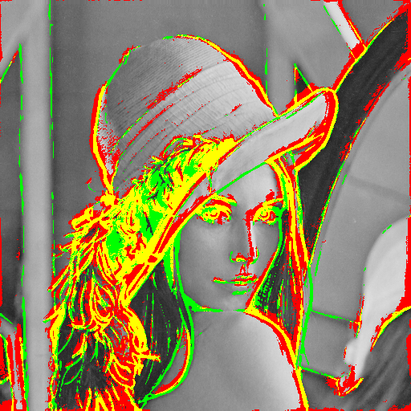
    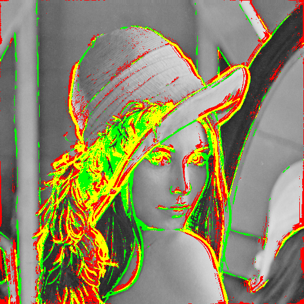
  </div>
  <figcaption>
    Final Results on Sketch 1 after Optimization
  </figcaption>
       <figcaption>
    Green indicates ground truth edges, red indicates detected edges, and yellow indicates correctly detected edges where the two overlap.
   </figcaption>
</figure>

#### Optimization output of sketch 2
For sketch 2, the optimal configuration was obtained using the sym4 wavelet with four decomposition levels and L2-based fusion, together with Otsu thresholding and a moderate cross-scale consistency constraint. Similar to sketch 1, the consistency condition required edge responses to be stable across at least two scales with a quantile threshold of 0.85, and no morphological opening was applied.

Under this configuration, the consistency-based method achieved a precision of 0.7750, a recall of 0.5873, and an F1 score of 0.6682. Compared to the baseline result, the consistency-based output shows improved suppression of fine texture edges, but the recall reduction is more pronounced than in sketch 1. This indicates that while sketch 2 benefits from smoother wavelet bases such as sym4, the stricter consistency constraint removes a larger portion of valid boundary pixels when the ground truth focuses on simplified contours.

Overall, the optimized results on sketch 2 confirm the same trade-off observed earlier: cross-scale consistency improves precision and visual cleanliness, but its effectiveness is strongly influenced by the style of the ground truth sketch.
<figure style="text-align: center;">
  <div style="display: flex; justify-content: center; gap: 10px;">
    
    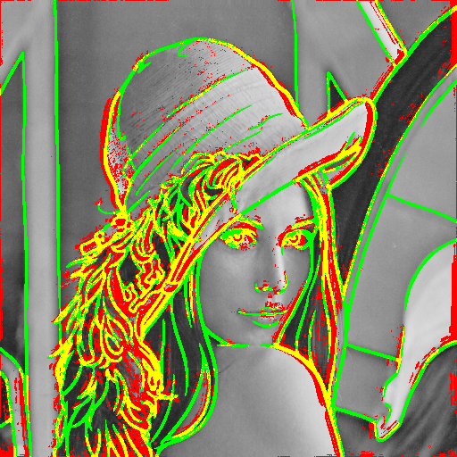
  </div>
  <figcaption>
    Final Results on Sketch 2 after Optimization
  </figcaption>
       <figcaption>
    Green indicates ground truth edges, red indicates detected edges, and yellow indicates correctly detected edges where the two overlap.
   </figcaption>
</figure>

After optimization, both sketches benefited from joint tuning of wavelet-related parameters and cross-scale consistency parameters, but their optimal configurations differed. Sketch 1 achieved its best performance with the db2 wavelet, resulting in a higher F1 score, while sketch 2 favored the smoother sym4 wavelet but reached a slightly lower overall accuracy.

The optimized results indicate that sketch 1, which preserves more fine structural details, allows the consistency-based method to retain valid boundary responses more effectively. In contrast, sketch 2 emphasizes coarse contours, making the method more sensitive to recall loss under the same consistency constraints. This comparison highlights that the effectiveness of cross-scale consistency depends not only on the algorithm parameters, but also on the annotation style of the ground truth.

#### Discussion on Optimization Trade-offs
During the optimization process, it was observed that improved parameter tuning does not always lead to monotonically better performance in terms of the F1 score. In particular, configurations that strengthen cross-scale consistency may result in lower recall, even when precision is improved.

This behavior arises from the nature of the consistency constraint. By requiring edge responses to be stable across multiple wavelet scales, the method effectively suppresses texture-induced and noise-related edges. However, this same constraint can also remove valid boundary pixels that appear strongly at only a limited number of scales, especially when the ground truth sketch emphasizes coarse or simplified contours.

As a result, parameter settings that are optimal for one sketch style or image structure may become suboptimal for another. This phenomenon reflects an inherent trade-off between precision and recall rather than a failure of the optimization procedure. The observed performance degradation under certain parameter combinations highlights the sensitivity of edge detection to annotation style and image content.

Overall, these results indicate that optimization in this context should be interpreted as balancing competing objectives rather than seeking a single universally optimal configuration.

## Discussion and Reflection
Through this series of experiments, it became clear that edge detection performance is strongly influenced not only by the algorithm itself, but also by the characteristics of the input image and the style of ground truth annotation. The initial failures on the cat image highlighted the limitations of intensity-based edge responses in the presence of dense textures, motivating a deeper investigation into parameter sensitivity and optimization.

By introducing systematic parameter optimization and jointly tuning wavelet-related parameters and cross-scale consistency constraints, the proposed pipeline achieved more stable and interpretable results on the Lena image. However, the comparison between different sketch styles further revealed that no single configuration performs optimally across all annotation styles. In particular, enforcing cross-scale consistency improves precision and visual clarity, but may lead to reduced recall when the ground truth emphasizes simplified contours.

Overall, these findings suggest that effective edge detection requires careful alignment between algorithm design, parameter selection, and evaluation criteria. Rather than pursuing a universally optimal setting, this work emphasizes the importance of understanding the interaction between image content, annotation style, and model behavior when interpreting quantitative evaluation results.